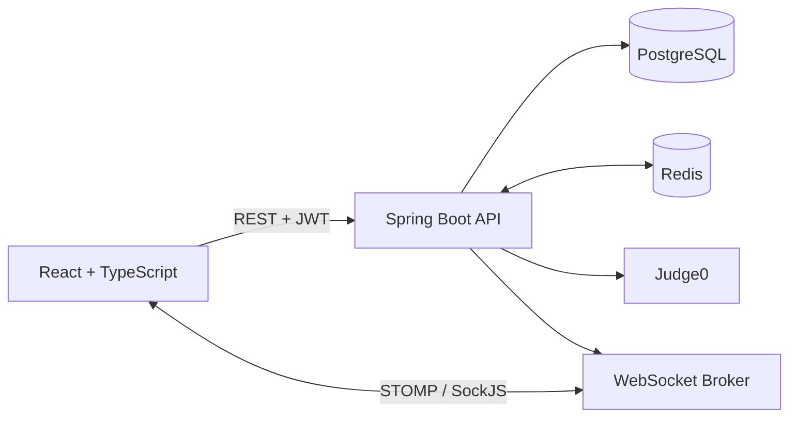

# CodeIT

CodeIT is a full-stack competitive programming platform where users can solve coding problems, run code against sample cases, submit solutions to hidden tests, and compete in timed contests with live leaderboards.

The project combines a React-based coding workspace with a Spring Boot API, PostgreSQL, Redis, Judge0, JWT authentication, and STOMP WebSocket updates.

> **Project status:** The core coding, judging, submission, and competition workflows are implemented. AI-assisted code explanation and correction are planned for a later phase; the current frontend AI panel does not yet have a backend implementation.

## Highlights

- Multi-language code editor powered by Monaco Editor
- Sample-test execution and detailed per-case results
- Hidden-test judging through Judge0
- Compile-once judging for supported languages
- Progressive batch judging fallback for C#
- JWT authentication with `USER` and `ADMIN` roles
- Timed competitions with personal contest sessions
- Live competition status, session, and leaderboard updates
- Redis cache-aside strategy for frequently accessed data
- Submission history and verdict tracking
- Admin APIs for problems, competitions, and users

## Architecture



### Main application flow

1. A user registers or logs in and receives a JWT.
2. The frontend loads problems and language options from the backend.
3. **Run** executes code against sample or custom input without saving a submission.
4. **Submit** loads hidden tests, selects a judging engine, evaluates the solution, and saves the verdict.
5. Competition submissions update the leaderboard and notify connected clients over WebSocket.

## Tech Stack

### Frontend

- React 19
- TypeScript 6
- Vite 8
- Tailwind CSS 4
- React Router 7
- Monaco Editor
- STOMP.js and SockJS
- React Datepicker
- Oxlint

### Backend

- Java 21
- Spring Boot 4.0.6
- Spring Web MVC
- Spring Security
- Spring JDBC with `JdbcTemplate`
- Spring Data Redis
- Spring WebSocket
- PostgreSQL
- JJWT
- Apache HttpClient 5
- Maven

### Infrastructure

- Judge0 for isolated code execution
- Redis for caching
- PostgreSQL for persistent data

## Features

### Authentication and authorization

- Registration with display name, unique user ID, email, and password
- Login using either email or unique user ID
- BCrypt password hashing
- Stateless JWT authentication
- Server-side identity extraction for submissions and competition actions
- Role-based access for `USER` and `ADMIN`
- Public registration always creates a `USER`, even if a role is supplied by the client

### Problems and coding workspace

- Browse, search, and filter coding problems
- Topic and difficulty organization
- Problem statements, examples, and constraints
- Monaco-based editor with starter templates
- Eleven supported programming languages
- Run visible samples or custom input
- Submit against hidden test cases
- Verdict, runtime, memory, passed-case count, and judge-engine display

### Submissions

- Supported-language discovery from the backend
- Run code without saving a database record
- Hidden-test evaluation on submit
- Output comparison in original test order
- Personal submission history
- Competition-aware submissions

### Competitions

- Upcoming, active, and ended competition states
- Join competitions before they end
- Per-user contest sessions
- Server-authoritative personal deadlines
- Explicit session ending and scheduled expiration
- Competition problem workspace
- Live leaderboard updates after accepted submissions
- Live global-status and personal-session events
- Admin-managed competition creation, problem assignment, and time updates

### Caching

CodeIT uses a cache-aside strategy for:

- Public problem details
- Full judge problem data
- Problem lists
- Parsed hidden test cases
- Competition lists and details
- Competition leaderboards

## Judge Architecture

CodeIT separates **Run** and **Submit** because they serve different purposes.

### Run

`POST /api/submissions/run` creates a normal Judge0 submission with `wait=true`.

- Executes one source file with one input
- Does not save a submission
- Used by the frontend for sample and custom-input execution
- The frontend compares sample output with the expected output

### Submit

`POST /api/submissions/submit` evaluates all hidden tests and stores the result.

```text
SubmissionService
        |
        v
TestCaseJudgeService
        |
        +--> CompileOnceJudgeService
        |
        +--> ProgressiveBatchJudgeService
                    |
                    v
               Judge0Service
```

### Compile-once engine

All currently supported languages except C# use the compile-once engine.

1. The backend creates a Base64 ZIP archive for Judge0's multi-file language, ID `89`.
2. The archive contains the user source, compile/run scripts, and hidden inputs.
3. Judge0 compiles the solution once.
4. The generated program runs separately for each input.
5. Each case receives its own timeout.
6. Framed outputs are decoded and compared in the original order.
7. The engine stops after a terminal runtime or timeout failure.

Default aggregate limits:

- Per-case timeout: 3 seconds
- Compile-once CPU limit: 30 seconds
- Compile-once wall limit: 45 seconds

### Progressive batch engine

C# uses progressive Judge0 batches.

- First batch: 3 hidden tests
- Later batches: 6 hidden tests
- Results are restored to request order
- Processing stops after the first failing batch
- Judge0 tokens are polled every 200 ms with a 60-second timeout

This is a static language-based route, not an automatic runtime fallback from compile-once.

### Output comparison

Trailing whitespace is removed from each line before comparison. Other output differences remain significant.

## Supported Languages

| Language | Slug | Judge0 ID | Submit engine |
| --- | --- | ---: | --- |
| C | `c` | 50 | Compile once |
| C# | `csharp` | 51 | Progressive batch |
| C++ | `cpp` | 54 | Compile once |
| Go | `go` | 60 | Compile once |
| Java | `java` | 62 | Compile once |
| JavaScript | `javascript` | 63 | Compile once |
| PHP | `php` | 68 | Compile once |
| Python | `python` | 71 | Compile once |
| Ruby | `ruby` | 72 | Compile once |
| Rust | `rust` | 73 | Compile once |
| TypeScript | `typescript` | 74 | Compile once |

The canonical runtime list is available from:

```http
GET /api/submissions/languages
Authorization: Bearer <token>
```

User programs must read from standard input and write to standard output.

## Competition Model

### Global competition status

Status is derived from the configured start and end times:

| Status | Condition |
| --- | --- |
| `UPCOMING` | Current time is before `startTime` |
| `ACTIVE` | Current time is between `startTime` and `endTime` |
| `ENDED` | Current time is after `endTime` |

The backend recalculates status on reads and updates, while a scheduler synchronizes status transitions every 60 seconds.

### Personal session status

| Status | Meaning |
| --- | --- |
| `JOINED` | User joined but has not started the personal timer |
| `IN_PROGRESS` | Personal timer is running |
| `ENDED` | User ended the session or the deadline expired |

The personal deadline is:

```text
min(session start + competition duration, global competition end)
```

Competition submissions require:

- Membership in the competition
- An `IN_PROGRESS` session
- An active global competition
- Time remaining before the personal deadline

### Leaderboard

The leaderboard ranks participants by:

1. Number of distinct accepted problems, descending
2. Total accepted runtime, ascending

Leaderboard results are cached in Redis and pushed after accepted competition submissions.

## Prerequisites

- JDK 21+
- Node.js `^20.19.0` or `>=22.12.0`
- PostgreSQL
- Redis
- A Judge0 instance with multi-file language ID `89`
- Docker is optional but convenient for Redis and Judge0

The Maven wrapper is included, so a separate Maven installation is not required.

## Local Setup

### 1. Clone the repository

```bash
git clone https://github.com/Sobhagyaverma/codeIT.git
cd codeIT
```

### 2. Create the PostgreSQL database

```bash
createdb -U postgres codeit
psql -U postgres -d codeit -f schema/schema.sql
```

The schema creates:

- `users`
- `problems`
- `competitions`
- `competition_problems`
- `competition_participants`
- `submissions`

For an older installation, apply the relevant manual migrations:

```bash
psql -U postgres -d codeit -f schema/users_name_uniqueuserid.sql
psql -U postgres -d codeit -f schema/competition_session.sql
```

There is currently no Flyway or Liquibase migration runner, so schema setup is manual.

### 3. Start Redis

Using Docker:

```bash
docker run -d --name codeit-redis -p 6379:6379 redis:7
redis-cli ping
```

The expected response is `PONG`.

### 4. Start Judge0

Install and start a self-hosted Judge0 instance using the official Judge0 instructions. CodeIT expects it at:

```text
http://localhost:2358
```

The submit engine requires Judge0's multi-file language ID `89` and standard GNU tools used by the generated runner scripts.

For local machines with limited resources, configure Judge0 worker count conservatively. For example:

```properties
COUNT=6
MAX_CPU_TIME_LIMIT=30
MAX_WALL_TIME_LIMIT=45
```

### 5. Configure the backend

Set environment variables before starting the API:

```bash
export SPRING_DATASOURCE_URL=jdbc:postgresql://localhost:5432/codeit
export SPRING_DATASOURCE_USERNAME=postgres
export SPRING_DATASOURCE_PASSWORD=your_password
export JUDGE0_API_URL=http://localhost:2358
export CODEIT_JWT_SECRET=replace-with-a-secret-at-least-32-characters-long
```

Additional Spring properties can override Redis host and port if needed:

```bash
export SPRING_DATA_REDIS_HOST=localhost
export SPRING_DATA_REDIS_PORT=6379
```

### 6. Start the backend

```bash
./mvnw spring-boot:run
```

The API starts at `http://localhost:9091`.

### 7. Configure and start the frontend

```bash
cd frontend
npm ci
```

Create `frontend/.env.local`:

```properties
VITE_API_URL=http://localhost:9091
```

Start the Vite development server:

```bash
npm run dev
```

The frontend starts at `http://localhost:5173`.

## Default Ports

| Service | Port |
| --- | ---: |
| React frontend | 5173 |
| Spring Boot API | 9091 |
| PostgreSQL | 5432 |
| Redis | 6379 |
| Judge0 | 2358 |

## Configuration Reference

| Property | Default | Purpose |
| --- | --- | --- |
| `server.port` | `9091` | Backend HTTP port |
| `judge0.api.url` | `http://localhost:2358` | Judge0 base URL |
| `codeit.jwt.expiration-ms` | `86400000` | JWT lifetime |
| `codeit.cache.leaderboard-ttl-seconds` | `60` | Leaderboard cache TTL |
| `codeit.cache.competition-ttl-seconds` | `120` | Competition cache TTL |
| `codeit.cache.problem-ttl-seconds` | `1800` | Problem cache TTL |
| `codeit.cache.testcase-ttl-seconds` | `1800` | Parsed test-case cache TTL |
| `codeit.judge.progressive-first-chunk` | `3` | Initial batch size |
| `codeit.judge.batch-chunk-size` | `6` | Later batch size |
| `codeit.judge.poll-interval-ms` | `200` | Judge0 polling interval |
| `codeit.judge.poll-timeout-ms` | `60000` | Judge0 polling timeout |
| `codeit.judge.case-timeout-seconds` | `3` | Per-case compile-once timeout |
| `codeit.judge.compile-once-cpu-time-limit` | `30` | Aggregate Judge0 CPU limit |
| `codeit.judge.compile-once-wall-time-limit` | `45` | Aggregate Judge0 wall limit |
| `codeit.http.connect-timeout-ms` | `3000` | Judge0 HTTP connect timeout |
| `codeit.http.read-timeout-ms` | `60000` | Judge0 HTTP response timeout |
| `codeit.http.max-total` | `8` | HTTP connection-pool maximum |
| `codeit.http.max-per-route` | `8` | Per-route connection maximum |

Do not rely on repository defaults for secrets or database credentials outside local development.

## Authentication

### Register

```bash
curl -X POST http://localhost:9091/api/user/register \
  -H "Content-Type: application/json" \
  -d '{
    "name": "Alice",
    "uniqueUserId": "alice1",
    "email": "alice@example.com",
    "password": "secret123"
  }'
```

### Login

```bash
curl -X POST http://localhost:9091/api/auth/login \
  -H "Content-Type: application/json" \
  -d '{
    "login": "alice1",
    "password": "secret123"
  }'
```

Example response:

```json
{
  "token": "eyJhbGciOiJIUzI1NiJ9...",
  "userId": 1,
  "email": "alice@example.com",
  "role": "USER",
  "expiresIn": 86400000
}
```

Use the token on protected requests:

```bash
curl http://localhost:9091/api/problems \
  -H "Authorization: Bearer <token>"
```

### Promote an admin

Public registration cannot create an administrator. Promote a trusted user directly in PostgreSQL:

```sql
UPDATE users
SET role = 'ADMIN'
WHERE email = 'alice@example.com';
```

Log in again so the new JWT contains the updated role.

## REST API

Auth levels:

- **Public** — no token required
- **JWT** — valid bearer token required
- **ADMIN** — valid bearer token with `ADMIN` role

### Authentication and users

| Method | Endpoint | Description | Auth |
| --- | --- | --- | --- |
| `POST` | `/api/auth/login` | Login and receive a JWT | Public |
| `POST` | `/api/user/register` | Register a `USER` account | Public |
| `GET` | `/api/user/getUsers` | List users | ADMIN |
| `GET` | `/api/user/getUser/{id}` | Get one user | ADMIN |
| `DELETE` | `/api/user/deleteUser/{id}` | Delete a user | ADMIN |

### Problems

| Method | Endpoint | Description | Auth |
| --- | --- | --- | --- |
| `GET` | `/api/problems` | List public problem data | JWT |
| `GET` | `/api/problems/{id}` | Get public problem details | JWT |
| `GET` | `/api/problems/difficulty/{difficulty}` | Filter by difficulty | JWT |
| `GET` | `/api/problems/topic/{topic}` | Filter by topic | JWT |
| `GET` | `/api/problems/search?keyword=` | Search by keyword | JWT |
| `POST` | `/api/problems` | Create a problem | ADMIN |

Hidden tests are excluded from public problem responses.

### Submissions

| Method | Endpoint | Description | Auth |
| --- | --- | --- | --- |
| `GET` | `/api/submissions/languages` | List supported languages | JWT |
| `POST` | `/api/submissions/run` | Execute code without saving | JWT |
| `POST` | `/api/submissions/submit` | Judge hidden tests and save verdict | JWT |
| `GET` | `/api/submissions/user/{userId}` | Own history, or any user as admin | JWT |
| `GET` | `/api/submissions/problem/{problemId}` | List submissions for a problem | JWT |

The backend overwrites submission user identity with the authenticated JWT user.

### Competitions

| Method | Endpoint | Description | Auth |
| --- | --- | --- | --- |
| `POST` | `/api/competitions/create` | Create a competition | ADMIN |
| `GET` | `/api/competitions/getAllCompetitions` | List competitions | JWT |
| `GET` | `/api/competitions/get/{id}` | Get a competition | JWT |
| `POST` | `/api/competitions/addProblemsTo/{competitionId}/problems` | Assign problems | ADMIN |
| `GET` | `/api/competitions/getProblemsOf/{competitionId}/problems` | Get competition problem IDs | JWT |
| `POST` | `/api/competitions/{competitionId}/join` | Join using JWT identity | JWT |
| `POST` | `/api/competitions/{competitionId}/start` | Start personal timer | JWT |
| `POST` | `/api/competitions/{competitionId}/end` | End personal session | JWT |
| `GET` | `/api/competitions/{competitionId}/session` | Get personal session | JWT |
| `GET` | `/api/competitions/{competitionId}/participants` | List participant IDs | JWT |
| `POST` | `/api/competitions/{competitionId}/submit` | Submit a contest solution | JWT |
| `GET` | `/api/competitions/{competitionId}/leaderboard` | Get standings | JWT |
| `PATCH` | `/api/competitions/{competitionId}/times` | Update start and end times | ADMIN |

### Health

| Method | Endpoint | Description | Auth |
| --- | --- | --- | --- |
| `GET` | `/api/health/redis` | Redis string/JSON smoke test | Public |

## Request Examples

### Run code

```bash
curl -X POST http://localhost:9091/api/submissions/run \
  -H "Authorization: Bearer <token>" \
  -H "Content-Type: application/json" \
  -d '{
    "languageId": 71,
    "language": "python",
    "code": "a, b = map(int, input().split())\nprint(a + b)",
    "stdin": "2 3"
  }'
```

### Submit a solution

```bash
curl -X POST http://localhost:9091/api/submissions/submit \
  -H "Authorization: Bearer <token>" \
  -H "Content-Type: application/json" \
  -d '{
    "problemId": 1,
    "languageId": 71,
    "language": "python",
    "code": "a, b = map(int, input().split())\nprint(a + b)"
  }'
```

Example verdict:

```json
{
  "verdict": "Accepted",
  "passedCount": 20,
  "totalCount": 20,
  "failedTestIndex": null,
  "time": 0.914,
  "memory": 0,
  "engine": "compile-once"
}
```

### Join and start a competition

```bash
curl -X POST http://localhost:9091/api/competitions/1/join \
  -H "Authorization: Bearer <token>"

curl -X POST http://localhost:9091/api/competitions/1/start \
  -H "Authorization: Bearer <token>"
```

No user ID is sent in either request; identity comes from the JWT.

## WebSocket Updates

CodeIT uses STOMP over SockJS for selected real-time competition events.

| Setting | Value |
| --- | --- |
| Endpoint | `http://localhost:9091/ws` |
| Broker prefix | `/topic` |
| Application prefix | `/app` |

### Topics

| Topic | Trigger | Payload |
| --- | --- | --- |
| `/topic/competitions/{id}/leaderboard` | Accepted contest submission | Leaderboard entries |
| `/topic/competitions/{id}/status` | Status transition or admin time update | `ContestStatusEvent` |
| `/topic/competitions/{id}/users/{userId}/session` | Start, explicit end, or expiration | `ContestSessionEvent` |

Initial page data is still loaded through REST. WebSocket events keep selected competition state synchronized afterward.

> **Security note:** `/ws` is currently public and permits all origin patterns. JWT authentication and topic authorization are planned improvements.

## Redis Cache Keys

| Key | Data | Default TTL |
| --- | --- | ---: |
| `problem:public:{id}` | Problem without hidden tests | 30 minutes |
| `problem:judge:{id}` | Full problem for judging | 30 minutes |
| `problem:all` | Problem list | 30 minutes |
| `testcases:problem:{id}` | Parsed hidden tests | 30 minutes |
| `competitions:all` | Competition list | 2 minutes |
| `competition:{id}` | Competition details | 2 minutes |
| `leaderboard:competition:{id}` | Leaderboard entries | 60 seconds |

Check Redis connectivity:

```bash
curl http://localhost:9091/api/health/redis
```

## Test-Case Format

Hidden tests are stored in the `problems.test_cases` JSONB column:

```json
[
  {
    "stdin": "2 3",
    "stdout": "5"
  },
  {
    "stdin": "-4 7",
    "stdout": "3"
  }
]
```

Problem topics, examples, constraints, and hidden tests use PostgreSQL JSONB columns.

## Testing and Quality Checks

### Backend tests

Run the complete Maven test suite:

```bash
./mvnw test
```

Run judge unit tests only:

```bash
./mvnw -Dtest=CompileOnceJudgeServiceTests,TestCaseJudgeServiceTests test
```

Run live Judge0 integration tests:

```bash
RUN_JUDGE0_INTEGRATION=true \
./mvnw -Dtest=CompileOnceJudgeServiceIntegrationTests test
```

Judge0 must be running at the configured URL. Integration tests are skipped when `RUN_JUDGE0_INTEGRATION` is not `true`.

Current backend coverage focuses on:

- Compile-once accepted, wrong-answer, and compilation-error behavior
- Judge engine routing
- Optional live Judge0 compile-once execution
- Spring application context startup

### Frontend checks

```bash
cd frontend
npm ci
npm run lint
npm run build
```

There is currently no frontend automated test suite.

## Project Structure

```text
CodeIT/
├── frontend/
│   ├── src/
│   │   ├── components/       # Navbar, verdict and run-result UI, AI placeholder
│   │   ├── context/          # Authentication context
│   │   ├── lib/              # API client, WebSocket client, judge utilities
│   │   └── pages/            # Problems, editor, competitions, admin, auth
│   └── package.json
├── schema/
│   ├── schema.sql
│   ├── competition_session.sql
│   └── users_name_uniqueuserid.sql
├── src/
│   ├── main/java/com/codeit/
│   │   ├── config/           # Security, Redis, HTTP, WebSocket, exceptions
│   │   └── modules/
│   │       ├── auth/         # Login, JWT, authenticated principal
│   │       ├── competition/  # Contests, sessions, leaderboard, events
│   │       ├── problems/     # Problem APIs, repository, cache
│   │       ├── submission/   # Judge0 and judging engines
│   │       └── user/         # Registration and admin user APIs
│   ├── main/resources/
│   │   └── application.properties
│   └── test/java/            # Unit, integration, and context tests
├── pom.xml
└── README.md
```

## Known Limitations

- AI explanation and code-correction endpoints are not implemented yet.
- The frontend AI panel should be treated as a planned feature.
- The WebSocket endpoint is not JWT-authenticated.
- Admin problem creation still needs frontend/backend contract alignment and end-to-end validation.
- The frontend has no automated test suite.
- Backend tests currently focus mainly on the judging pipeline.
- Judge0 is an external dependency and is not bundled or version-pinned by this repository.
- Compile-once scripts assume Judge0 multi-file ID `89` and standard Judge0/GNU tool paths.
- Database migrations are manual.
- CORS is currently configured for local frontend origins.
- Repository configuration contains development defaults; production credentials must be supplied externally.

## Roadmap

- Implement AI-powered code explanation and correction
- Authenticate STOMP connections and authorize competition topics
- Add progressive-batch and competition integration tests
- Add frontend component and end-to-end tests
- Align and validate the admin problem-creation workflow
- Add rate limiting for Run and Submit
- Introduce Flyway or Liquibase migrations
- Add Docker Compose for a one-command local environment
- Improve observability with structured logs and metrics
