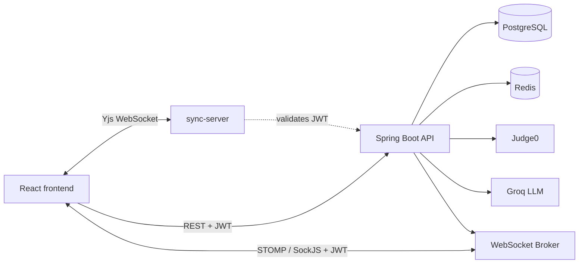

# CodeT

**CodeT** is a full-stack competitive programming platform for solving problems, running and submitting code against an automated judge, joining timed contests with live leaderboards, collaborating in shared rooms, and receiving AI-assisted mentoring.

| | |
| --- | --- |
| **Live site** | [https://codet.in](https://codet.in) |
| **API** | [https://api.codet.in](https://api.codet.in) |
| **Repository** | [github.com/Sobhagyaverma/codeIT](https://github.com/Sobhagyaverma/codeIT) |

**Stack:** React + TypeScript · Spring Boot · PostgreSQL · Redis · Judge0 · JWT · STOMP WebSockets · Yjs sync server · Docker

---

## Table of contents

- [Highlights](#highlights)
- [Architecture](#architecture)
- [Tech stack](#tech-stack)
- [Features](#features)
- [Judge architecture](#judge-architecture)
- [Supported languages](#supported-languages)
- [Competition model](#competition-model)
- [Sync server](#sync-server)
- [Prerequisites](#prerequisites)
- [Local setup](#local-setup)
- [Production deployment](#production-deployment)
- [Configuration reference](#configuration-reference)
- [Authentication & roles](#authentication--roles)
- [REST API overview](#rest-api-overview)
- [WebSocket updates](#websocket-updates)
- [Caching](#caching)
- [Test-case format](#test-case-format)
- [Testing](#testing)
- [Project structure](#project-structure)
- [Known limitations](#known-limitations)
- [Documentation](#documentation)

---

## Highlights

- Multi-language Monaco editor with sample **Run** and hidden-test **Submit**
- Compile-once judging (most languages) and progressive-batch judging (C#)
- JWT authentication with `USER` / `ADMIN` roles (role re-read from DB on every request)
- Timed competitions with personal sessions and live leaderboards
- Collaborative **CodeRooms** and problem rooms (presence, chat, shared editor, whiteboard)
- **Quick Clash** short competitive sessions
- AI learning coach: explain, hints, analyze, review (Groq-backed, rate-limited)
- Admin Command Center: problem and competition studios
- Rate limiting on auth, judge, AI, rooms, and admin writes
- Redis for OTP, rate limits, and cache-aside
- Production stack: Vercel frontend + Docker API/sync/Redis/Nginx + Cloudflare Tunnel + Supabase Postgres

---

## Architecture


```mermaid
flowchart LR
    Browser[React frontend] -->|REST + JWT| API[Spring Boot API]
    Browser <-->|STOMP / SockJS + JWT| WS[WebSocket Broker]
    Browser <-->|Yjs WebSocket| Sync[sync-server]
    API --> PostgreSQL[(PostgreSQL)]
    API --> Redis[(Redis)]
    API --> Judge0[Judge0]
    API --> Groq[Groq LLM]
    API --> WS
    Sync -.->|validates JWT| API
```

### Production topology

| Component | Hosting |
| --- | --- |
| Frontend (`frontend/`) | Vercel → `codet.in` / `www.codet.in` |
| API + Nginx + Redis + sync-server | Homelab / VPS via Docker Compose |
| Public API | Cloudflare Tunnel → `api.codet.in` |
| Database | Supabase Postgres (Session pooler) or local Compose Postgres |
| Judge0 | Private host only (e.g. `:2358`); never exposed publicly |

### Application flow

1. Register or log in and receive a JWT.
2. Load problems and languages from the API.
3. **Run** executes against sample/custom input (frontend-driven samples; not persisted).
4. **Submit** judges all hidden tests from `problems.test_cases` and stores the verdict.
5. Competition submissions update the leaderboard over STOMP.
6. Collaboration rooms use Spring for membership, chat, and run/submit; the sync-server hosts Yjs documents (`room:{id}:code`, `room:{id}:whiteboard`).
7. Admins use `/admin` for problem and competition authoring.

---

## Tech stack

| Layer | Technologies |
| --- | --- |
| Frontend | React 19, TypeScript, Vite, Tailwind 4, Monaco, Yjs, STOMP/SockJS |
| Backend | Java 21, Spring Boot 4, Security, JDBC, Flyway, WebSocket, JJWT, HttpClient 5 |
| Sync | Node.js, `ws`, Yjs (`y-protocols`) |
| Data / infra | PostgreSQL, Redis, Judge0, Groq, Docker, Nginx, Cloudflare Tunnel |

---

## Features

### Authentication

- Register with display name, unique user ID, email, and password
- Email verification OTP (Brevo SMTP + Redis); login blocked until verified
- Login with email or unique user ID
- Sensitive credentials encrypted client-side (RSA-OAEP) before POST; bcrypt on the server
- Forgot-password OTP wizard; JWT `token_version` invalidates old sessions on password change / logout
- Cloudflare Turnstile captcha on auth and contact flows (required in `prod`)
- Registration modes: `OPEN`, `INVITE_ONLY`, `COLLEGE_ONLY`
- Contact form → `/api/contact` (stored + emailed)
- Roles: `USER` (default on register) and `ADMIN` (promote via SQL)

### Problems and coding workspace

- Browse, search, and filter problems by difficulty and topic
- Monaco editor with starter templates for all supported languages
- Run samples or custom stdin; submit against hidden tests
- Verdict, runtime, memory, passed-case count, and engine name

### Competitions

- Status derived from start/end times: `UPCOMING` / `ACTIVE` / `ENDED`
- Join, start personal timer, end session
- Live leaderboard, status, and session events over STOMP

### Quick Clash

- Short-form competitive sessions with lobby, ready state, and live play
- See Flyway `V8__quick_clash.sql` and related API modules

### Collaboration

- **CodeRoom** — freeform shared editor + whiteboard
- **Problem Collab** — shared problem workspace with run/submit
- Roles: `HOST`, `EDITOR`, `VIEWER`
- Invite tokens, presence, chat, host notes
- Details: [`docs/COLLABORATION_ARCHITECTURE.md`](docs/COLLABORATION_ARCHITECTURE.md)

### Admin Command Center

ADMIN-only UI at `/admin` (also `/admin/competitions`, `/admin/competitions/create`, problem studios):

| Area | Purpose | Backend |
| --- | --- | --- |
| Dashboard | KPIs, recent items, quick actions | List APIs |
| Problem Repository | Search / filter / paginate | `GET /api/problems` |
| Problem Studio | Statement, examples, hidden tests | `POST /api/problems` |
| Competition Repository | List / filter contests | `GET /api/competitions/getAllCompetitions` |
| Competition Studio | Create contest + ordered problem set | `POST …/create` + `addProblemsTo` |

Studio drafts autosave to **localStorage** only (no draft API).

### AI learning coach

- Groq-backed mentor: explain, constraints, hints, analyze, failure review, editorial
- Rate-limited with gated hint progression
- Requires `GROQ_API_KEY` (never commit the key)

### Rate limiting

Enabled by default (`codeit.ratelimit.enabled=true`). Covers login/register, run/submit (burst + sustained + daily), AI, room actions, problems read, and admin writes. See `application.properties` for limits.

### DSA Sheet

- Structured lesson and practice paths in the frontend (`/dsa-sheet`)

---

## Judge architecture

**Run** (`POST /api/submissions/run`) — one Judge0 execution with caller-supplied stdin; not saved as a submission.

**Submit** (`POST /api/submissions/submit`) — evaluates all hidden tests from `test_cases` and stores the result.

```text
SubmissionService → TestCaseJudgeService
        ├── CompileOnceJudgeService         (all languages except C#)
        └── ProgressiveBatchJudgeService    (C#)
                    └── Judge0Service
```

### Compile-once

Uses Judge0 multi-file language ID `89`: compile once, run per input, stop on terminal failure.

Defaults: 3s per case, 30s CPU / 45s wall aggregate (configurable).

### Progressive batch (C#)

First batch of 3 cases, then batches of 6; stop after first failing batch; poll every 200 ms (60s timeout).

### Output comparison

Trailing whitespace per line is ignored; other differences fail the case.

Programs must read **stdin** and write **stdout**.

---

## Supported languages

| Language | Slug | Judge0 ID | Submit engine |
| --- | --- | ---: | --- |
| C | `c` | 50 | Compile once |
| C# | `csharp` | 51 | Progressive batch |
| C++ | `cpp` | 54 | Compile once |
| Go | `go` | 60 | Compile once |
| Java | `java` | 62 | Compile once |
| JavaScript | `javascript` | 63 | Compile once |
| PHP | `php` | 68 | Compile once |
| Python | `python` | 71 | Compile once |
| Ruby | `ruby` | 72 | Compile once |
| Rust | `rust` | 73 | Compile once |
| TypeScript | `typescript` | 74 | Compile once |

```http
GET /api/submissions/languages
Authorization: Bearer <token>
```

---

## Competition model

| Global status | Condition |
| --- | --- |
| `UPCOMING` | before `startTime` |
| `ACTIVE` | between `startTime` and `endTime` |
| `ENDED` | after `endTime` |

| Session status | Meaning |
| --- | --- |
| `JOINED` | joined; timer not started |
| `IN_PROGRESS` | personal timer running |
| `ENDED` | ended or deadline expired |

Personal deadline: `min(session start + duration, global end)`.

Leaderboard: distinct accepted problems (desc), then total accepted runtime (asc).

---

## Sync server

The **sync-server** (`sync-server/`) is a Node.js WebSocket sidecar for real-time CRDT sync via **Yjs**. It does **not** replace the Spring API for rooms, chat, or judging.

| Concern | Owner |
| --- | --- |
| Auth, rooms, membership, chat, run/submit | Spring Boot |
| Live shared editor & whiteboard documents | sync-server |

- Documents: `room:{roomId}:code`, `room:{roomId}:whiteboard`
- Clients connect with a JWT (`CODEIT_JWT_SECRET` must match the API)
- Connection, per-room, per-doc, and message rate limits are configurable
- Health: `GET /health` · WebSocket path: `/sync`
- Local: `ws://localhost:1234/sync` · Production: typically `wss://api.codet.in/sync`

See [`sync-server/README.md`](sync-server/README.md).

---

## Prerequisites

- JDK 21+
- Node.js `^20.19.0` or `>=22.12.0`
- PostgreSQL (local or Supabase)
- Redis (required for OTP, rate limits, and cache)
- Judge0 with multi-file language `89`
- Optional: `GROQ_API_KEY` for AI coach
- Optional: Brevo SMTP for email OTP / contact
- Optional: Cloudflare Turnstile (required for `prod` profile)

Maven wrapper is included (`./mvnw`).

---

## Local setup

### 1. Clone

```bash
git clone https://github.com/Sobhagyaverma/codeIT.git
cd codeIT
```

### 2. PostgreSQL

```bash
createdb -U postgres codeit
psql -U postgres -d codeit -f schema/schema.sql
```

Flyway applies incremental migrations on API startup (`src/main/resources/db/migration/`), including AI coach, collaboration, email verification, contact messages, friends, notifications, Quick Clash, indexes, private beta, and timestamp hardening.

Profile API notes: [`docs/PROFILE_API_INTEGRATION.md`](docs/PROFILE_API_INTEGRATION.md).

### 3. Redis

Redis is enabled by default (`codeit.redis.enabled=true`). Without Redis, OTP flows fail closed (`EMAIL_TEMPORARILY_UNAVAILABLE`).

```bash
docker run -d --name codeit-redis -p 6379:6379 redis:7
```

Optional overrides: `SPRING_DATA_REDIS_HOST`, `SPRING_DATA_REDIS_PORT`, `SPRING_DATA_REDIS_PASSWORD`.

### 4. Email (Brevo SMTP)

```bash
export CODEIT_MAIL_ENABLED=true
export CODEIT_MAIL_FROM='CodeT <noreply@example.com>'
export CODEIT_MAIL_INBOX='you@example.com'
export SPRING_MAIL_USERNAME='your-brevo-login-email'
export BREVO_SMTP_KEY='your-smtp-key'
export CODEIT_OTP_PEPPER='long-random-pepper'
```

Defaults: `smtp-relay.brevo.com:587` (STARTTLS). Checklist: [`docs/EMAIL_OTP_CONTACT_TEST.md`](docs/EMAIL_OTP_CONTACT_TEST.md).

### 5. Cloudflare Turnstile

```bash
export CODEIT_CAPTCHA_ENABLED=true
export TURNSTILE_SITE_KEY=your-site-key
export TURNSTILE_SECRET_KEY=your-secret-key
```

Frontend loads the site key from `GET /api/captcha/config`. Captcha stays off when `CODEIT_CAPTCHA_ENABLED` is false (local default).

### 6. Judge0

Point `JUDGE0_API_URL` at your Judge0 instance (local default often `http://localhost:2358`).

- Homelab: [`docs/JUDGE0_HOMELAB_DEPLOY.md`](docs/JUDGE0_HOMELAB_DEPLOY.md)
- DigitalOcean: [`docs/JUDGE0_DIGITALOCEAN_DEPLOY.md`](docs/JUDGE0_DIGITALOCEAN_DEPLOY.md)

### 7. Backend environment

```bash
export SPRING_DATASOURCE_URL=jdbc:postgresql://localhost:5432/codeit
export SPRING_DATASOURCE_USERNAME=postgres
export SPRING_DATASOURCE_PASSWORD=your_password
export JUDGE0_API_URL=http://localhost:2358
export CODEIT_JWT_SECRET=replace-with-a-secret-at-least-32-characters-long
export CODEIT_OTP_PEPPER=long-random-pepper
export SYNC_INTERNAL_SECRET=change-me-sync-internal-secret
# Optional:
export GROQ_API_KEY=your_groq_api_key
```

Never commit secrets or API keys.

### 8. Start API

```bash
./mvnw spring-boot:run
```

API: `http://localhost:9091` · Health: `GET /api/health`

### 9. Sync server

```bash
cd sync-server
cp .env.example .env   # CODEIT_JWT_SECRET must match the API
npm ci
npm start
```

### 10. Frontend

```bash
cd frontend
npm ci
npm run dev
```

Dev server: **http://localhost:5175**. Vite proxies `/api` and `/ws` → `:9091`, and `/sync` → sync-server `:1234`.

Optional (`frontend/.env`):

```properties
VITE_API_URL=
VITE_SYNC_WS_URL=
```

### Default ports

| Service | Port |
| --- | ---: |
| Frontend | 5175 |
| Spring Boot API | 9091 |
| Yjs sync-server | 1234 |
| PostgreSQL | 5432 |
| Redis | 6379 |
| Judge0 | 2358 |

---

## Production deployment

Recommended path (homelab / VPS + Supabase + Vercel):

```bash
cp .env.example .env   # fill all secrets
docker compose -f docker-compose.yml -f docker-compose.supabase.yml up -d --build
```

Local Postgres in Compose instead of Supabase:

```bash
docker compose up -d --build
```

### Production checklist (summary)

1. Fill `.env` from `.env.example` (`REDIS_PASSWORD`, `CODEIT_JWT_SECRET`, Turnstile, CORS, Judge0 URL, etc.).
2. Use Supabase **Session pooler** on IPv4-only hosts (`sslmode=require`).
3. Set `CODEIT_CORS_ORIGINS` and `CODEIT_PUBLIC_BASE_URL` to your site (e.g. `https://codet.in`).
4. Expose only Nginx `:80` (or tunnel); keep Postgres, Redis, API, sync, and Judge0 private.
5. Deploy frontend on Vercel with:

   ```text
   VITE_API_URL=https://api.codet.in
   VITE_SYNC_WS_URL=wss://api.codet.in/sync
   ```

6. Point `api.` DNS at Cloudflare Tunnel (or origin); apex/`www` at Vercel.
7. After **raw SQL** edits to problems, invalidate Redis keys (Compose Redis requires AUTH):

   ```bash
   docker compose exec redis redis-cli -a "$REDIS_PASSWORD" \
     DEL problem:public:ID problem:judge:ID problem:all testcases:problem:ID
   ```

Full checklist: [`deploy/PRODUCTION_CHECKLIST.md`](deploy/PRODUCTION_CHECKLIST.md) · Compose notes: [`deploy/README.md`](deploy/README.md).

---

## Configuration reference

| Property | Default | Purpose |
| --- | --- | --- |
| `server.port` | `9091` | Backend HTTP port |
| `judge0.api.url` | (env `JUDGE0_API_URL`) | Judge0 base URL |
| `codeit.redis.enabled` | `true` | Redis for OTP, rate limits, cache |
| `codeit.jwt.expiration-ms` | `86400000` | JWT lifetime |
| `codeit.ratelimit.enabled` | `true` | HTTP / judge / AI / room limits |
| `codeit.ai.enabled` | `true` | AI coach |
| `codeit.ai.groq.api-key` | `${GROQ_API_KEY:}` | Groq API key |
| `codeit.registration.mode` | `INVITE_ONLY` | Registration gate |
| `codeit.cache.*` | see `application.properties` | Cache TTLs |
| `codeit.judge.*` | see `application.properties` | Judge timeouts / limits |
| `codeit.http.*` | see `application.properties` | Judge0 HTTP pool / timeouts |

---

## Authentication & roles

### Register

```bash
curl -X POST http://localhost:9091/api/user/register \
  -H "Content-Type: application/json" \
  -d '{
    "name": "Alice",
    "uniqueUserId": "alice1",
    "email": "alice@example.com",
    "password": "secret123"
  }'
```

### Login

```bash
curl -X POST http://localhost:9091/api/auth/login \
  -H "Content-Type: application/json" \
  -d '{
    "login": "alice1",
    "password": "secret123"
  }'
```

Use `Authorization: Bearer <token>` on protected routes.

### Promote an admin

```sql
UPDATE users SET role = 'ADMIN' WHERE email = 'alice@example.com';
```

Log out and log in again so the frontend session picks up the new role. The API already loads role from the database on each request, so demotion takes effect immediately for admin APIs.

---

## REST API overview

Auth: **Public** · **JWT** · **ADMIN**

### Auth and users

| Method | Endpoint | Auth |
| --- | --- | --- |
| `POST` | `/api/auth/login` | Public |
| `POST` | `/api/user/register` | Public |
| `GET` | `/api/user/getUsers` | ADMIN |
| `GET` | `/api/user/getUser/{id}` | ADMIN |
| `DELETE` | `/api/user/deleteUser/{id}` | ADMIN |

### Problems

| Method | Endpoint | Description | Auth |
| --- | --- | --- | --- |
| `GET` | `/api/problems` | List problems | JWT / public read (as configured) |
| `GET` | `/api/problems/{id}` | Problem details (no hidden tests) | JWT / public read |
| `GET` | `/api/problems/difficulty/{difficulty}` | Filter | JWT |
| `GET` | `/api/problems/topic/{topic}` | Filter | JWT |
| `GET` | `/api/problems/search?keyword=` | Search | JWT |
| `POST` | `/api/problems` | Create problem | ADMIN |

### Submissions

| Method | Endpoint | Description | Auth |
| --- | --- | --- | --- |
| `GET` | `/api/submissions/languages` | Supported languages | JWT |
| `POST` | `/api/submissions/run` | Execute without saving | JWT |
| `POST` | `/api/submissions/submit` | Judge hidden tests + save | JWT |
| `GET` | `/api/submissions/user/{userId}` | History (own or ADMIN) | JWT |
| `GET` | `/api/submissions/problem/{problemId}` | Submissions for a problem | JWT |

### Competitions

| Method | Endpoint | Description | Auth |
| --- | --- | --- | --- |
| `POST` | `/api/competitions/create` | Create | ADMIN |
| `GET` | `/api/competitions/getAllCompetitions` | List | JWT |
| `GET` | `/api/competitions/get/{id}` | Detail | JWT |
| `POST` | `/api/competitions/addProblemsTo/{id}/problems` | Assign problems | ADMIN |
| `GET` | `/api/competitions/getProblemsOf/{id}/problems` | Problem IDs | JWT |
| `POST` | `/api/competitions/{id}/join` | Join | JWT |
| `POST` | `/api/competitions/{id}/start` | Start session | JWT |
| `POST` | `/api/competitions/{id}/end` | End session | JWT |
| `GET` | `/api/competitions/{id}/session` | Session state | JWT |
| `GET` | `/api/competitions/{id}/participants` | Participants | JWT |
| `POST` | `/api/competitions/{id}/submit` | Contest submit | JWT |
| `GET` | `/api/competitions/{id}/leaderboard` | Standings | JWT |
| `PATCH` | `/api/competitions/{id}/times` | Update times | ADMIN |

### Collaboration rooms

| Method | Endpoint | Auth |
| --- | --- | --- |
| `POST` | `/api/rooms` | JWT |
| `POST` | `/api/rooms/join/{inviteToken}` | JWT |
| `GET` | `/api/rooms/{roomId}` | JWT |
| `GET` | `/api/rooms/{roomId}/sync-token` | JWT |
| `POST` | `/api/rooms/{roomId}/run` | JWT |
| `POST` | `/api/rooms/{roomId}/submit` | JWT |
| `GET` / `POST` | `/api/rooms/{roomId}/messages` | JWT |

### AI coach

| Method | Endpoint | Auth |
| --- | --- | --- |
| `POST` | `/api/ai/coach` | JWT |
| `POST` | `/api/ai/explain` | JWT |
| `POST` | `/api/ai/hints` | JWT |
| `POST` | `/api/ai/analyze` | JWT |
| `POST` | `/api/ai/analyze-failure` | JWT |
| `POST` | `/api/ai/review` | JWT |

### Health

| Method | Endpoint | Auth |
| --- | --- | --- |
| `GET` | `/api/health` | Public |
| `GET` | `/api/health/redis` | Public |

---

## WebSocket updates

STOMP over SockJS:

| Setting | Value |
| --- | --- |
| Endpoint | `/ws` (e.g. `http://localhost:9091/ws`) |
| Broker prefix | `/topic` |
| Application prefix | `/app` |

The SockJS handshake is public; **STOMP CONNECT requires a JWT**.

### Competition topics

| Topic | Trigger |
| --- | --- |
| `/topic/competitions/{id}/leaderboard` | Accepted contest submission |
| `/topic/competitions/{id}/status` | Status / time change |
| `/topic/competitions/{id}/users/{userId}/session` | Start / end / expire |

### Collaboration topics

Room presence, chat, and run events under `/topic/rooms/...` — see collaboration architecture docs.

---

## Caching

Redis cache-aside keys (when Redis is enabled):

| Key | Default TTL |
| --- | ---: |
| `problem:public:{id}` / `problem:judge:{id}` / `problem:all` | 30 min |
| `testcases:problem:{id}` | 30 min |
| `competitions:all` / `competition:{id}` | 2 min |
| `leaderboard:competition:{id}` | 60 s |

Admin UI updates invalidate cache via the API. **Raw SQL updates do not** — delete the relevant keys after editing problems in the database.

---

## Test-case format

Hidden tests live in `problems.test_cases` (JSONB). The judge expects:

```json
[
  { "stdin": "2 3", "stdout": "5" },
  { "stdin": "-4 7", "stdout": "3" }
]
```

- **Submit** uses `test_cases` only.
- **Run** (sample cases in the UI) uses problem `examples`. Prefer raw stdin/stdout strings in examples so sample runs match the judge format.
- Tree and other structured problems should define an explicit competitive-programming I/O format in the problem description; store matching `stdin` / `stdout` strings.

Constraints belong in `constraints_data` (separate from the description).

---

## Testing

```bash
./mvnw test
./mvnw -Dtest=CompileOnceJudgeServiceTests,TestCaseJudgeServiceTests test
RUN_JUDGE0_INTEGRATION=true ./mvnw -Dtest=CompileOnceJudgeServiceIntegrationTests test
```

```bash
cd frontend && npm ci && npm run lint && npm run build
```

---

## Project structure

```text
CodeT/
├── frontend/                    # Product UI (Vite / React)
│   └── src/
│       ├── components/
│       ├── features/
│       ├── lib/
│       └── pages/
├── sync-server/                 # Yjs WebSocket sidecar
├── schema/                      # Base SQL bootstrap
├── docs/                        # Architecture & deploy guides
├── deploy/                      # Nginx, checklists, ops
├── docker-compose.yml           # API, Redis, sync, Nginx (+ optional Postgres)
├── docker-compose.supabase.yml  # Override: Supabase instead of Compose Postgres
├── src/main/java/com/codeit/
│   ├── config/
│   ├── security/ratelimit/
│   └── modules/
│       ├── ai/
│       ├── auth/
│       ├── collaboration/
│       ├── competition/
│       ├── problems/
│       ├── profile/
│       ├── quickclash/
│       ├── submission/
│       └── user/
├── src/main/resources/
│   ├── application.properties
│   ├── application-prod.properties
│   ├── ai/prompts/
│   └── db/migration/            # Flyway
└── pom.xml
```

---

## Known limitations

- No full automated E2E suite yet; backend tests focus mainly on the judging pipeline.
- Judge0 is external and not version-pinned by this repository.
- Base schema is bootstrapped via `schema/schema.sql`; Flyway covers incremental migrations.
- Competition draft/publish/edit APIs are limited; studios use create + local drafts.
- Some practice / competition dashboard fields remain backlog — see docs below.

---

## Documentation

| Document | Topic |
| --- | --- |
| [`frontend/README.md`](frontend/README.md) | UI runbook and screen map |
| [`deploy/README.md`](deploy/README.md) | Compose / Nginx / homelab deploy |
| [`deploy/PRODUCTION_CHECKLIST.md`](deploy/PRODUCTION_CHECKLIST.md) | Production go-live checklist |
| [`docs/COLLABORATION_ARCHITECTURE.md`](docs/COLLABORATION_ARCHITECTURE.md) | Rooms, Yjs, roles |
| [`docs/JUDGE0_HOMELAB_DEPLOY.md`](docs/JUDGE0_HOMELAB_DEPLOY.md) | Judge0 on homelab |
| [`docs/JUDGE0_DIGITALOCEAN_DEPLOY.md`](docs/JUDGE0_DIGITALOCEAN_DEPLOY.md) | Judge0 on DigitalOcean |
| [`docs/PROFILE_API_INTEGRATION.md`](docs/PROFILE_API_INTEGRATION.md) | Profile API |
| [`docs/PRIVATE_BETA_READINESS.md`](docs/PRIVATE_BETA_READINESS.md) | Private beta |
| [`docs/EMAIL_OTP_CONTACT_TEST.md`](docs/EMAIL_OTP_CONTACT_TEST.md) | Email / OTP / contact testing |
| [`sync-server/README.md`](sync-server/README.md) | Sync server limits and runbook |

---

## License

Private / proprietary unless otherwise stated in the repository.
