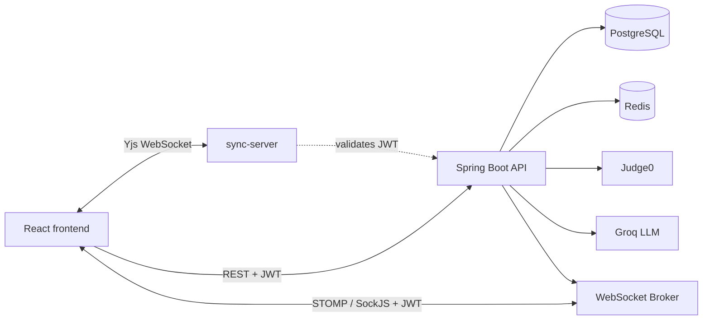

# CodeT

CodeT is a full-stack competitive programming platform for solving problems, running and submitting code, joining timed contests with live leaderboards, collaborating in shared rooms, and getting AI-assisted mentoring.

Stack: React + TypeScript frontends, Spring Boot API, PostgreSQL, Redis, Judge0, JWT auth, STOMP WebSockets, and a Yjs sync server for real-time editor/whiteboard sync.

> **Project status:** Core coding, judging, submissions, competitions, profile, AI learning coach (Groq), collaboration (CodeRoom + Problem Collab), and an ADMIN Command Center (problem + competition studios) are implemented. The product UI lives in `frontend/` (Stitch-based).

## Highlights

- Multi-language Monaco editor with sample run and hidden-test submit
- Compile-once judging (most languages) and progressive-batch judging (C#)
- JWT auth with `USER` / `ADMIN` roles
- Timed competitions with personal sessions and live leaderboards
- Collaborative CodeRooms and problem rooms (presence, chat, shared editor, whiteboard)
- AI learning coach: explain, hints, analyze, review (Groq-backed)
- ADMIN Command Center: problem repository/studio, competition repository/studio
- Rate limiting on auth, judge run/submit, AI, rooms, and admin writes
- Redis cache-aside when enabled (optional; off by default)

## Architecture


```mermaid
flowchart LR
    Browser[React frontend] -->|REST + JWT| API[Spring Boot API]
    Browser <-->|STOMP / SockJS + JWT| WS[WebSocket Broker]
    Browser <-->|Yjs WebSocket| Sync[sync-server]
    API --> PostgreSQL[(PostgreSQL)]
    API --> Redis[(Redis)]
    API --> Judge0[Judge0]
    API --> Groq[Groq LLM]
    API --> WS
    Sync -.->|validates JWT| API
```

### Frontend

| App | Path | Dev URL | Role |
| --- | --- | --- | --- |
| **UI** | `frontend/` | http://localhost:5175 | Product UI (Stitch screens + admin) |

Talks to the API (`9091`) and sync-server (`1234`). Auth storage keys use `codeit.stitch.*`.

### Main application flow

1. Register or log in and receive a JWT.
2. Load problems and languages from the API.
3. **Run** executes against sample/custom input without saving a submission.
4. **Submit** judges hidden tests and stores the verdict.
5. Competition submissions update the leaderboard over STOMP.
6. Collaboration rooms use Spring for room membership/chat/run, and the sync-server for Yjs docs (`room:{id}:code`, `room:{id}:whiteboard`).
7. Admins use `/admin` (Stitch) for problem and competition authoring.

## Tech Stack

| Layer        | Technologies                                                                           |
| ------------ | -------------------------------------------------------------------------------------- |
| Frontend     | React 19, TypeScript, Vite, Tailwind 4, Monaco, Excalidraw (legacy), Yjs, STOMP/SockJS |
| Backend      | Java 21, Spring Boot 4, Security, JDBC, Flyway, WebSocket, JJWT, HttpClient 5          |
| Data / infra | PostgreSQL, Redis, Judge0, Groq, Node sync-server                                      |

## Features

### Authentication

- Register with display name, unique user ID, email, password
- Email verification OTP (Brevo SMTP + Redis); login blocked until verified
- Login with email or unique user ID
- Forgot-password OTP wizard (request → verify → reset); JWT `token_version` invalidates old sessions
- Contact form posts to `/api/contact` (stored + emailed to inbox)
- BCrypt passwords, stateless JWT, `USER` / `ADMIN` roles
- Public registration always creates `USER`
- Profile settings (`/settings/profile`) for all logged-in users

### Problems and coding workspace

- Browse, search, and filter problems
- Monaco editor with starter templates (11 languages)
- Run samples or custom input; submit against hidden tests
- Verdict, runtime, memory, passed-case count, and engine name

### Competitions

- Upcoming / active / ended status from start/end times
- Join, start personal timer, end session
- Live leaderboard, status, and session events over STOMP

### Collaboration

- **CodeRoom** — freeform shared editor + whiteboard
- **Problem Collab** — shared problem workspace with run/submit
- Roles: `HOST`, `EDITOR`, `VIEWER`
- Invite codes, presence, chat, DSA whiteboard library
- Details: [`docs/COLLABORATION_ARCHITECTURE.md`](docs/COLLABORATION_ARCHITECTURE.md)

### Admin Command Center (Stitch)

ADMIN-only UI at `/admin` (also `/admin/competitions`, `/admin/competitions/create`):

| Area                   | What it does                                              | Backend used                               |
| ---------------------- | --------------------------------------------------------- | ------------------------------------------ |
| Dashboard              | KPIs, recent problems/competitions, quick actions         | List APIs                                  |
| Problem Repository     | Search/filter/paginate problems                           | `GET /api/problems`                        |
| Problem Studio         | Author statement, examples, hidden tests, Monaco starters | `POST /api/problems`                       |
| Competition Repository | List/filter contests                                      | `GET /api/competitions/getAllCompetitions` |
| Competition Studio     | Create contest + ordered problem set                      | `POST …/create` + `addProblemsTo`          |

Draft autosave in studios is **localStorage** only (no draft API). Fields not on the DTO (slug, rules toggles, judge sliders, scoring model) stay UI-only.

### AI learning coach

- Groq-backed mentor for explain, constraints, hints, analyze, failure review, editorial
- Rate-limited; gated hint progression
- Requires `GROQ_API_KEY` (never commit the key)

### Rate limiting

Enabled by default (`codeit.ratelimit.enabled=true`). Covers login/register, run/submit (burst + sustained + daily), AI, room actions, problems read, and admin writes. See `application.properties` for limits.

### Caching

- Redis cache-aside when enabled (`codeit.redis.enabled=true`, default on). OTP requires Redis.

## Judge Architecture

**Run** (`POST /api/submissions/run`) — one Judge0 submission with `wait=true`; not saved.

**Submit** (`POST /api/submissions/submit`) — evaluates all hidden tests and stores the result.

```text
SubmissionService → TestCaseJudgeService
        ├── CompileOnceJudgeService   (all langs except C#)
        └── ProgressiveBatchJudgeService  (C#)
                    └── Judge0Service
```

### Compile-once

Uses Judge0 multi-file language ID `89`: compile once, run per input, stop on terminal failure.

Defaults: 3s per case, 30s CPU / 45s wall aggregate.

### Progressive batch (C#)

First batch 3 cases, then batches of 6; stop after first failing batch; poll every 200 ms (60s timeout).

### Output comparison

Trailing whitespace per line is ignored; other differences matter.

## Supported Languages

| Language   | Slug         | Judge0 ID | Submit engine     |
| ---------- | ------------ | --------: | ----------------- |
| C          | `c`          |        50 | Compile once      |
| C#         | `csharp`     |        51 | Progressive batch |
| C++        | `cpp`        |        54 | Compile once      |
| Go         | `go`         |        60 | Compile once      |
| Java       | `java`       |        62 | Compile once      |
| JavaScript | `javascript` |        63 | Compile once      |
| PHP        | `php`        |        68 | Compile once      |
| Python     | `python`     |        71 | Compile once      |
| Ruby       | `ruby`       |        72 | Compile once      |
| Rust       | `rust`       |        73 | Compile once      |
| TypeScript | `typescript` |        74 | Compile once      |

```http
GET /api/submissions/languages
Authorization: Bearer <token>
```

Programs must read stdin and write stdout.

## Competition Model

| Global status | Condition                         |
| ------------- | --------------------------------- |
| `UPCOMING`    | before `startTime`                |
| `ACTIVE`      | between `startTime` and `endTime` |
| `ENDED`       | after `endTime`                   |

| Session status | Meaning                   |
| -------------- | ------------------------- |
| `JOINED`       | joined, timer not started |
| `IN_PROGRESS`  | personal timer running    |
| `ENDED`        | ended or deadline expired |

Personal deadline: `min(session start + duration, global end)`.

Leaderboard: distinct accepted problems (desc), then total accepted runtime (asc).

## Prerequisites

- JDK 21+
- Node.js `^20.19.0` or `>=22.12.0`
- PostgreSQL
- Judge0 with multi-file language `89`
- Redis enabled by default (OTP / rate limits / cache)
- `GROQ_API_KEY` if using the AI coach

Maven wrapper is included (`./mvnw`).

## Local Setup

### 1. Clone

```bash
git clone https://github.com/Sobhagyaverma/codeIT.git
cd codeIT
```

### 2. PostgreSQL

```bash
createdb -U postgres codeit
psql -U postgres -d codeit -f schema/schema.sql
```

Flyway runs automatically on API startup for incremental migrations:

- `V1__ai_coach_tables.sql`
- `V2__collaboration_rooms.sql`
- `V3__room_host_note.sql`
- `V4__email_verified_and_token_version.sql`
- `V5__contact_messages.sql`

For older databases that predate the consolidated `schema.sql`, apply the legacy one-shots under `schema/` if needed (`users_name_uniqueuserid.sql`, `competition_session.sql`, `profile.sql`).

Profile API notes: [`docs/PROFILE_API_INTEGRATION.md`](docs/PROFILE_API_INTEGRATION.md).

### 3. Redis (required)

Redis is **enabled by default** (`codeit.redis.enabled=true`). OTP / forgot-password require it (fail closed with `EMAIL_TEMPORARILY_UNAVAILABLE` without Redis). Rate limits and cache-aside also use Redis when the server is up.

Start Redis before the API:

```bash
docker run -d --name codeit-redis -p 6379:6379 redis:7
```

Optional overrides: `SPRING_DATA_REDIS_HOST`, `SPRING_DATA_REDIS_PORT`.

### 3b. Email (Brevo free SMTP)

1. Create a free [Brevo](https://www.brevo.com/) account → SMTP & API → generate an SMTP key
2. Set env vars (never commit keys):

```bash
export CODEIT_MAIL_ENABLED=true
export CODEIT_MAIL_FROM='CodeT <noreply@yourdomain-or-brevo-sender>'
export CODEIT_MAIL_INBOX='you@example.com'   # Contact Us destination
export SPRING_MAIL_USERNAME='your-brevo-login-email'
export BREVO_SMTP_KEY='your-smtp-key'
export CODEIT_OTP_PEPPER='long-random-pepper'
```

Defaults in `application.properties`: host `smtp-relay.brevo.com`, port `587`, STARTTLS.

Manual test checklist: [`docs/EMAIL_OTP_CONTACT_TEST.md`](docs/EMAIL_OTP_CONTACT_TEST.md).

### 3c. Cloudflare Turnstile (captcha)

Protects login, register, verify-email, forgot-password, and contact when enabled.

1. Create a widget in the [Cloudflare Turnstile dashboard](https://dash.cloudflare.com/?to=/:account/turnstile)
2. Set env vars:

```bash
export CODEIT_CAPTCHA_ENABLED=true
export TURNSTILE_SITE_KEY=your-site-key
export TURNSTILE_SECRET_KEY=your-secret-key
```

Frontend loads site key from `GET /api/captcha/config`. Captcha stays off when `CODEIT_CAPTCHA_ENABLED` is false (local default).

### 4. Judge0

Expect Judge0 at `https://judge0.ktatva.com` (override with `JUDGE0_API_URL` if needed).

- Homelab: [`docs/JUDGE0_HOMELAB_DEPLOY.md`](docs/JUDGE0_HOMELAB_DEPLOY.md)
- DigitalOcean: [`docs/JUDGE0_DIGITALOCEAN_DEPLOY.md`](docs/JUDGE0_DIGITALOCEAN_DEPLOY.md)

### 5. Backend env

```bash
export SPRING_DATASOURCE_URL=jdbc:postgresql://localhost:5432/codeit
export SPRING_DATASOURCE_USERNAME=postgres
export SPRING_DATASOURCE_PASSWORD=your_password
export JUDGE0_API_URL=https://judge0.ktatva.com
export CODEIT_JWT_SECRET=replace-with-a-secret-at-least-32-characters-long
export GROQ_API_KEY=your_groq_api_key
export CODEIT_MAIL_ENABLED=true
export CODEIT_MAIL_FROM='CodeT <noreply@example.com>'
export CODEIT_MAIL_INBOX=you@example.com
export SPRING_MAIL_USERNAME=your-brevo-login-email
export BREVO_SMTP_KEY=your-smtp-key
export CODEIT_OTP_PEPPER=long-random-pepper
export CODEIT_CAPTCHA_ENABLED=true
export TURNSTILE_SITE_KEY=your-site-key
export TURNSTILE_SECRET_KEY=your-secret-key
```

Never put API keys in source files or commits.

### 6. Start API

```bash
./mvnw spring-boot:run
```

API: `http://localhost:9091`

### 7. Sync server (collaboration)

```bash
cd sync-server
cp .env.example .env   # set CODEIT_JWT_SECRET to match the API
npm ci
npm start
```

Or: `docker compose up sync-server --build` (port `1234`).

### 8. Frontend

```bash
cd frontend
npm ci
npm run dev
```

Opens at **http://localhost:5175**. Dev proxies `/api` + `/ws` → `http://localhost:9091` and `/sync` → sync-server `:1234`. Optional:

```properties
VITE_API_URL=
VITE_SYNC_WS_URL=
```

Promote a user to admin (SQL), then open `/admin`.

## Default Ports

| Service | Port |
| --- | ---: |
| Frontend (`frontend`) | 5175 |
| Spring Boot API | 9091 |
| Yjs sync-server | 1234 |
| PostgreSQL | 5432 |
| Redis (optional) | 6379 |
| Judge0                              | 2358 |

## Configuration Reference

| Property                   | Default                      | Purpose                                |
| -------------------------- | ---------------------------- | -------------------------------------- |
| `server.port`              | `9091`                       | Backend HTTP port                      |
| `judge0.api.url`           | `https://judge0.ktatva.com`  | Judge0 base URL                        |
| `codeit.redis.enabled`     | `true`                       | Enable Redis (OTP, rate limits, cache) |
| `codeit.jwt.expiration-ms` | `86400000`                   | JWT lifetime                           |
| `codeit.ratelimit.enabled` | `true`                       | HTTP / judge / AI / room limits        |
| `codeit.ai.enabled`        | `true`                       | AI coach                               |
| `codeit.ai.groq.api-key`   | `${GROQ_API_KEY:}`           | Groq API key                           |
| `codeit.cache.*`           | see `application.properties` | Cache TTLs when Redis is on            |
| `codeit.judge.*`           | see `application.properties` | Judge batch / timeout settings         |
| `codeit.http.*`            | see `application.properties` | Judge0 HTTP pool / timeouts            |

## Authentication

### Register

```bash
curl -X POST http://localhost:9091/api/user/register \
  -H "Content-Type: application/json" \
  -d '{
    "name": "Alice",
    "uniqueUserId": "alice1",
    "email": "alice@example.com",
    "password": "secret123"
  }'
```

### Login

```bash
curl -X POST http://localhost:9091/api/auth/login \
  -H "Content-Type: application/json" \
  -d '{
    "login": "alice1",
    "password": "secret123"
  }'
```

Use `Authorization: Bearer <token>` on protected routes.

### Promote an admin

```sql
UPDATE users SET role = 'ADMIN' WHERE email = 'alice@example.com';
```

Log in again for a JWT with the new role.

## REST API

Auth: **Public** | **JWT** | **ADMIN**

### Auth and users

| Method   | Endpoint                    | Auth   |
| -------- | --------------------------- | ------ |
| `POST`   | `/api/auth/login`           | Public |
| `POST`   | `/api/user/register`        | Public |
| `GET`    | `/api/user/getUsers`        | ADMIN  |
| `GET`    | `/api/user/getUser/{id}`    | ADMIN  |
| `DELETE` | `/api/user/deleteUser/{id}` | ADMIN  |

### Problems

| Method | Endpoint                                | Description                | Auth  |
| ------ | --------------------------------------- | -------------------------- | ----- |
| `GET`  | `/api/problems`                         | List public problem data   | JWT   |
| `GET`  | `/api/problems/{id}`                    | Get public problem details | JWT   |
| `GET`  | `/api/problems/difficulty/{difficulty}` | Filter by difficulty       | JWT   |
| `GET`  | `/api/problems/topic/{topic}`           | Filter by topic            | JWT   |
| `GET`  | `/api/problems/search?keyword=`         | Search by keyword          | JWT   |
| `POST` | `/api/problems`                         | Create a problem           | ADMIN |

Hidden tests are excluded from public problem responses.

### Submissions

| Method | Endpoint                               | Description                         | Auth |
| ------ | -------------------------------------- | ----------------------------------- | ---- |
| `GET`  | `/api/submissions/languages`           | List supported languages            | JWT  |
| `POST` | `/api/submissions/run`                 | Execute code without saving         | JWT  |
| `POST` | `/api/submissions/submit`              | Judge hidden tests and save verdict | JWT  |
| `GET`  | `/api/submissions/user/{userId}`       | Own history, or any user as admin   | JWT  |
| `GET`  | `/api/submissions/problem/{problemId}` | List submissions for a problem      | JWT  |

### Competitions

| Method  | Endpoint                                                   | Description                 | Auth  |
| ------- | ---------------------------------------------------------- | --------------------------- | ----- |
| `POST`  | `/api/competitions/create`                                 | Create a competition        | ADMIN |
| `GET`   | `/api/competitions/getAllCompetitions`                     | List competitions           | JWT   |
| `GET`   | `/api/competitions/get/{id}`                               | Get a competition           | JWT   |
| `POST`  | `/api/competitions/addProblemsTo/{competitionId}/problems` | Assign problems             | ADMIN |
| `GET`   | `/api/competitions/getProblemsOf/{competitionId}/problems` | Get competition problem IDs | JWT   |
| `POST`  | `/api/competitions/{competitionId}/join`                   | Join using JWT identity     | JWT   |
| `POST`  | `/api/competitions/{competitionId}/start`                  | Start personal timer        | JWT   |
| `POST`  | `/api/competitions/{competitionId}/end`                    | End personal session        | JWT   |
| `GET`   | `/api/competitions/{competitionId}/session`                | Get personal session        | JWT   |
| `GET`   | `/api/competitions/{competitionId}/participants`           | List participant IDs        | JWT   |
| `POST`  | `/api/competitions/{competitionId}/submit`                 | Submit a contest solution   | JWT   |
| `GET`   | `/api/competitions/{competitionId}/leaderboard`            | Get standings               | JWT   |
| `PATCH` | `/api/competitions/{competitionId}/times`                  | Update start and end times  | ADMIN |

### Collaboration rooms

| Method       | Endpoint                         | Auth |
| ------------ | -------------------------------- | ---- |
| `POST`       | `/api/rooms`                     | JWT  |
| `POST`       | `/api/rooms/join/{inviteToken}`  | JWT  |
| `GET`        | `/api/rooms/{roomId}`            | JWT  |
| `GET`        | `/api/rooms/{roomId}/sync-token` | JWT  |
| `POST`       | `/api/rooms/{roomId}/run`        | JWT  |
| `POST`       | `/api/rooms/{roomId}/submit`     | JWT  |
| `GET`/`POST` | `/api/rooms/{roomId}/messages`   | JWT  |

### AI coach

| Method | Endpoint                  | Auth |
| ------ | ------------------------- | ---- |
| `POST` | `/api/ai/coach`           | JWT  |
| `POST` | `/api/ai/explain`         | JWT  |
| `POST` | `/api/ai/hints`           | JWT  |
| `POST` | `/api/ai/analyze`         | JWT  |
| `POST` | `/api/ai/analyze-failure` | JWT  |
| `POST` | `/api/ai/review`          | JWT  |

### Health

| Method | Endpoint            | Auth   |
| ------ | ------------------- | ------ |
| `GET`  | `/api/health/redis` | Public |

## WebSocket Updates

STOMP over SockJS:

| Setting            | Value                      |
| ------------------ | -------------------------- |
| Endpoint           | `http://localhost:9091/ws` |
| Broker prefix      | `/topic`                   |
| Application prefix | `/app`                     |

The SockJS handshake is public; **STOMP CONNECT requires a JWT** (`Authorization: Bearer` / STOMP headers via `StompAuthChannelInterceptor`).

### Competition topics

| Topic                                             | Trigger                     |
| ------------------------------------------------- | --------------------------- |
| `/topic/competitions/{id}/leaderboard`            | Accepted contest submission |
| `/topic/competitions/{id}/status`                 | Status / time change        |
| `/topic/competitions/{id}/users/{userId}/session` | Start / end / expire        |

### Collaboration topics

Room presence, chat, and run events under `/topic/rooms/...` (see collaboration architecture doc).

## Redis Cache Keys (when enabled)

| Key                                                          | Default TTL |
| ------------------------------------------------------------ | ----------: |
| `problem:public:{id}` / `problem:judge:{id}` / `problem:all` |      30 min |
| `testcases:problem:{id}`                                     |      30 min |
| `competitions:all` / `competition:{id}`                      |       2 min |
| `leaderboard:competition:{id}`                               |        60 s |

## Test-Case Format

Hidden tests in `problems.test_cases` (JSONB):

```json
[
  { "stdin": "2 3", "stdout": "5" },
  { "stdin": "-4 7", "stdout": "3" }
]
```

Admin Problem Studio may send examples / topics / constraints / test cases as JSON strings matching the `Problem` entity string fields.

## Testing and Quality Checks

```bash
./mvnw test
./mvnw -Dtest=CompileOnceJudgeServiceTests,TestCaseJudgeServiceTests test
RUN_JUDGE0_INTEGRATION=true ./mvnw -Dtest=CompileOnceJudgeServiceIntegrationTests test
```

```bash
cd frontend && npm ci && npm run lint && npm run build
```

## Project Structure

```text
CodeT/
├── frontend/                 # Product UI (port 5175)
│   └── src/
│       ├── components/       # AppNav, SoftPageFade, …
│       ├── features/
│       ├── lib/
│       └── pages/            # product + Admin* studios
├── sync-server/              # Yjs WebSocket sidecar
├── schema/                   # Base SQL bootstrap (+ legacy one-shots)
├── docs/                     # Architecture and deploy guides
├── deploy/                   # Nginx + production checklist
├── docker-compose.yml        # Full stack (optional local Postgres)
├── docker-compose.supabase.yml  # Override: Supabase instead of compose Postgres
├── src/main/java/com/codeit/
│   ├── config/
│   ├── security/ratelimit/   # HTTP / judge / AI / room limits
│   └── modules/
│       ├── ai/
│       ├── auth/
│       ├── collaboration/
│       ├── competition/
│       ├── problems/
│       ├── profile/
│       ├── submission/
│       └── user/
├── src/main/resources/
│   ├── application.properties
│   ├── application-prod.properties
│   ├── ai/prompts/
│   └── db/migration/         # Flyway
└── pom.xml
```

## Known Limitations

- No automated E2E suite yet.
- Backend tests focus mainly on the judging pipeline.
- Judge0 is external and not version-pinned by this repo.
- Base schema is still bootstrapped via `schema/schema.sql`; Flyway covers incremental AI/collab tables.
- CORS is tuned for local frontend origins; override with `CODEIT_CORS_ORIGINS` in prod.
- Production Compose stack: see [`deploy/README.md`](deploy/README.md) (Supabase override available).
- Competition draft/publish/edit and rich dashboard fields are not on the API yet (studios use create + local draft).
- Practice dashboard and some competition-dashboard fields remain backlog (see `docs/PRACTICE_API_REQUIREMENTS.md`, `docs/COMPETITIONS_DASHBOARD_API.md`).

## Roadmap

- Broader backend/frontend automated tests
- Competition draft / update / publish APIs
- Observability (structured logs, metrics)

## Docs

| Doc | Topic |
| --- | --- |
| [`frontend/README.md`](frontend/README.md) | UI runbook + screen map |
| [`deploy/README.md`](deploy/README.md) | Compose / Nginx / homelab deploy |
| [`docs/COLLABORATION_ARCHITECTURE.md`](docs/COLLABORATION_ARCHITECTURE.md) | Rooms, Yjs, roles |
| [`docs/JUDGE0_HOMELAB_DEPLOY.md`](docs/JUDGE0_HOMELAB_DEPLOY.md) | Judge0 on homelab |
| [`docs/JUDGE0_DIGITALOCEAN_DEPLOY.md`](docs/JUDGE0_DIGITALOCEAN_DEPLOY.md) | Judge0 on DO |
| [`docs/PROFILE_API_INTEGRATION.md`](docs/PROFILE_API_INTEGRATION.md) | Profile API |
| [`sync-server/README.md`](sync-server/README.md) | Sync server |
