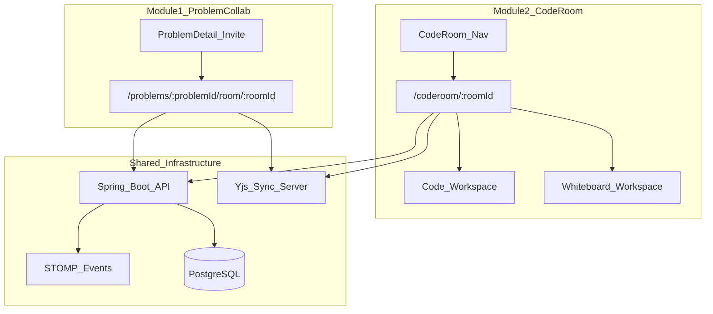

# CodeIT Collaboration Architecture

Single source of truth for the real-time collaboration system: Problem-page Invite (shared solve) and CodeRoom (Code + Whiteboard).

---

## 1. Feature summary

Two **separate** products that share infrastructure (Spring Boot rooms, STOMP events, Yjs sync, PostgreSQL).

| | **Problem Collab** | **CodeRoom** |
| --- | --- | --- |
| **Entry** | Invite on the problem page | Nav → `/coderoom` hub |
| **What it does** | Shared solve of one problem: live code, presence, chat, shared Run + Submit | Freeform code workspace: live code, presence, chat, Run only, host-switched whiteboard |
| **Bound to a problem?** | Yes | No |
| **Submit?** | Yes (shared) | No |
| **Whiteboard?** | No | Yes (host-controlled tab) |

**Problem Collab does NOT:** provide a whiteboard, support unbound freeform sessions, or act as a general CodeRoom.

**CodeRoom does NOT:** bind to a problem, support shared Submit / judge verdicts, or use the problem-page invite flow.

---

## 2. System diagram



---

## 3. Technology choices

**Split responsibility — do not put editor keystrokes through Spring.**

| Technology | Owns |
| --- | --- |
| **Spring Boot** | Authoritative room state: rooms, members, roles, invites, chat history, run/submit orchestration, workspace mode; issues short-lived Yjs `syncToken` |
| **Yjs** (+ y-websocket Node sidecar) | High-frequency sync: shared Monaco text, whiteboard shapes, cursors |
| **STOMP** (over existing WebSocket config) | Ephemeral events: presence, chat live delivery, run/submit broadcast, workspace switch, permission changes |
| **PostgreSQL** | Durable storage: `rooms`, `room_members`, `room_messages`, `room_snapshots`, `room_events` |

Editor sync at typing speed needs CRDTs (Yjs). Mixing keystrokes into Spring STOMP creates lag and conflict bugs.

---

## 4. URL routes

Path-based room IDs (preferred over query params).

| Route | Purpose |
| --- | --- |
| `/problems/:id/room/:roomId` | Problem collab session (invite link) |
| `/coderoom` | CodeRoom hub (create / join) |
| `/coderoom/:roomId` | Live CodeRoom workspace |

---

## 5. Database tables

Flyway migration: `V2__collaboration_rooms.sql`. Module: `com.codeit.modules.collaboration`.

| Table | Purpose |
| --- | --- |
| **rooms** | Room metadata: `type` (`PROBLEM_COLLAB` \| `CODEROOM`), optional `problem_id`, host, invite token, `active_workspace` (`CODE` \| `WHITEBOARD`), language, status |
| **room_members** | Membership + role (`HOST` \| `EDITOR` \| `VIEWER`), join / last-seen timestamps |
| **room_messages** | Persisted chat history |
| **room_snapshots** | Periodic Yjs binary state per workspace (`CODE` \| `WHITEBOARD`) — survives server restart |
| **room_events** | Append-only audit log — enables future session replay |

Design notes:

- One `rooms` table with a `type` discriminator — shared invite/member logic, different UI rules.
- Switching Code ↔ Whiteboard does **not** destroy either Y.Doc; both stay alive; UI only toggles visibility.

---

## 6. API endpoints

Base path: `/api/rooms`

| Method | Endpoint | Who | Purpose |
| --- | --- | --- | --- |
| `POST` | `/api/rooms` | Auth | Create room (`type`, optional `problemId`, `language`) |
| `GET` | `/api/rooms/:roomId` | Member | Room metadata + members |
| `POST` | `/api/rooms/join/:inviteToken` | Auth | Join by invite link |
| `PATCH` | `/api/rooms/:roomId/members/:userId` | Host | Change role / kick |
| `POST` | `/api/rooms/:roomId/transfer-host` | Host | Transfer host |
| `PATCH` | `/api/rooms/:roomId/workspace` | Host | Switch CODE ↔ WHITEBOARD (CodeRoom only) |
| `GET` | `/api/rooms/:roomId/messages` | Member | Chat history (paginated) |
| `POST` | `/api/rooms/:roomId/run` | Editor+ | Trigger shared run (returns `jobId`) |
| `POST` | `/api/rooms/:roomId/submit` | Editor+ | Shared submit (Problem Collab only) |

Room run/submit delegates to existing `SubmissionService` / `Judge0Service`, then broadcasts results via STOMP.

**Yjs auth:** Spring issues a short-lived `syncToken` (JWT, ~5 min) scoped to `roomId` + `userId`. The Node sidecar validates it before accepting the WebSocket connection.

---

## 7. STOMP topics

| Topic | Direction | Payload |
| --- | --- | --- |
| `/topic/rooms/{roomId}/presence` | Server → clients | Join / leave, user list |
| `/topic/rooms/{roomId}/chat` | Server → clients | New message |
| `/topic/rooms/{roomId}/run` | Server → clients | Run started / result |
| `/topic/rooms/{roomId}/submit` | Server → clients | Submit verdict |
| `/topic/rooms/{roomId}/workspace` | Server → clients | Active workspace changed |
| `/topic/rooms/{roomId}/permissions` | Server → clients | Role changes, kick |

Client → server chat: `/app/rooms/{roomId}/chat` (after STOMP JWT auth interceptor).

---

## 8. Permissions matrix

| Action | HOST | EDITOR | VIEWER |
| --- | --- | --- | --- |
| Edit code | Yes | Yes | No |
| Run code | Yes | Yes | No |
| Submit (Problem Collab) | Yes | Yes | No |
| Chat | Yes | Yes | Yes |
| Invite / kick / transfer host | Yes | No | No |
| Switch workspace (CodeRoom) | Yes | No | No |
| Draw on whiteboard | Yes | Yes | No |

---

## 9. Folder structure

### Backend

```
src/main/java/com/codeit/modules/collaboration/
  controller/
  service/
  repository/
  dto/
  events/
```

### Frontend

```
frontend/src/features/collaboration/
  types.ts
  adapters.ts
  api.ts
  hooks/
    useRoom.ts
    useRoomPresence.ts
    useRoomChat.ts
    useYjsCodeEditor.ts
    useYjsWhiteboard.ts
    useLocalRoomPersistence.ts
  components/
    InviteButton.tsx
    ParticipantsPanel.tsx
    RoomChat.tsx
    WorkspaceSwitcher.tsx
    SharedRunPanel.tsx
    PresenceAvatars.tsx

frontend/src/pages/
  ProblemCollabRoom.tsx
  CodeRoomHub.tsx
  CodeRoomWorkspace.tsx

frontend/src/components/
  CodeWorkspace.tsx
```

### Sync server

```
sync-server/
  package.json
  server.js          # y-websocket + JWT validation
  Dockerfile
  README.md
```

Yjs documents: `room:{roomId}:code` and `room:{roomId}:whiteboard`.

---

## 10. Phase roadmap

| Task | Scope |
| --- | --- |
| **1** | Architecture doc + empty folder scaffold (backend, frontend, `sync-server/`) |
| **2** | Flyway migration `V2__collaboration_rooms.sql` (`rooms`, `room_members`, `room_messages`, `room_snapshots`, `room_events`) |
| **3** | Room JDBC repository + DTOs (no controller yet) |
| **4** | Room REST APIs — create, join, get, member management |
| **5** | STOMP JWT auth + presence + chat topics |
| **6** | Yjs sync-server sidecar + Docker Compose + `syncToken` endpoint |
| **7** | Extract `CodeWorkspace` + `useYjsCodeEditor` hook |
| **8** | Problem page Invite flow + `/problems/:id/room/:roomId` + shared run/submit |
| **9** | CodeRoom hub + workspace page + nav entry |
| **10** | tldraw whiteboard + host workspace switch + local persistence |

Each task is completed before the next begins.
